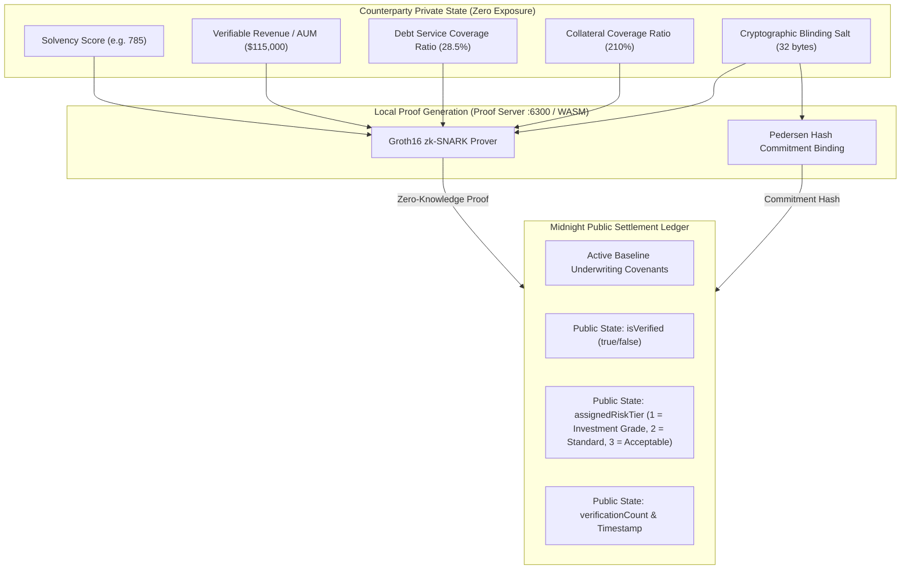

# AegisSolv — Confidential Solvency Attestation & Institutional Private Credit Underwriting Gate (Product Proposal)

> **Midnight Ecosystem Domain:** Confidential Solvency Attestation & Institutional Private Credit  
> **Category:** Confidential DeFi — prove institutional solvency and debt-service capacity without surrendering proprietary balance sheets or financial positions.  
> **Network Target:** Midnight Preview / Preprod  
> **Contract Address:** [`0xae6c15336b55bf034b4320563dec45f2d727f23aa32f19812eced4134919e730`](https://preview.midnightexplorer.com/contracts/0xae6c15336b55bf034b4320563dec45f2d727f23aa32f19812eced4134919e730)

---

## 1. Executive Summary

Institutional private credit origination — the \$1.7 trillion market spanning direct lending, real-estate bridge loans, trade finance, and structured credit — is fundamentally broken by a data disclosure paradox. To access capital, institutional borrowers must surrender audited financial statements, capitalization tables, debt service schedules, and proprietary revenue data to every prospective lender in a syndicated deal. This creates massive competitive intelligence exposure: every capital raise forces issuers to share sensitive financial positions with dozens of counterparties who may include direct competitors, activist investors, or institutions with conflicting interests.

In decentralized finance (DeFi) and on-chain RWA (Real-World Asset) markets, the problem inverts: the complete absence of verifiable solvency attestations forces lending protocols to mandate 150% to 200% overcollateralization, locking up tens of billions of dollars in idle capital and excluding legitimate institutional borrowers who maintain strong balance sheets and debt-service capacity.

AegisSolv resolves this paradox by introducing a Zero-Knowledge Confidential Solvency Gate built natively on the Midnight Network. Institutional counterparties maintain their solvency metrics — asset coverage ratios, verifiable revenue, debt-service coverage, and collateral buffers — in local client memory. Using Compact smart contracts and Groth16 zk-SNARKs, counterparties generate mathematical proofs demonstrating compliance with underwriting covenants. Only binary verification booleans, derived algorithmic risk tiers, and timestamps cross into the public domain. No balance sheet data, no revenue figures, no proprietary financial positions are ever transmitted, stored, or exposed on-chain.

---

## 2. The Chosen Problem & Midnight Fit

| Challenge in Institutional Credit & RWA Markets | Midnight Architectural Solution in AegisSolv |
| :--- | :--- |
| Proprietary Data Leakage in Syndication | Sensitive witness data (`solvencyScore`, `verifiableRevenue`, `debtServiceCoverage`, `salt`) never leaves local RAM. Counterparties prove covenant compliance without exposing financial positions. |
| Capital-Inefficient Overcollateralization in DeFi | Investment-Grade (Tier A) counterparties unlock undercollateralized (110%) capital facilities based on mathematically provable solvency, freeing billions in locked capital. |
| Rigid Smart Contract Logic for Diverse Syndicates | Circuit 2 (`verifyCustomPolicy`) allows arbitrary DeFi liquidity pools, DAO treasuries, and institutional syndicates to evaluate counterparties against custom covenant thresholds dynamically without contract re-deployment. |
| Regulatory & Governance Compliance | Circuit 3 (`updatePolicy`) enables institutional risk committees and multisig governance to adjust baseline underwriting covenants on-chain in response to macroeconomic shifts, rate cycles, and regulatory changes. |

---

## 3. Cryptographic Architecture & Circuit Blueprint

AegisSolv's Compact contract (`shieldscore.compact`) defines three specialized ZK circuits for institutional solvency verification:



### Circuit 1: `verifyCreditPassport` (Standard Institutional Solvency Verification)
- Evaluates private counterparty credentials against global on-chain underwriting covenants.
- Enforces strict assertions: `score >= minCreditScore`, `income >= minAnnualIncome`, `dtiBps <= maxDebtToIncomeRatioBps`, `collateralBps >= minCollateralRatioBps`.
- Derives algorithmic risk tiers:
  - Tier A (Investment Grade): Score >= 780, DSCR <= 30%, Collateral >= 200%. Unlocks prime facility terms (6.2% APR, 110% collateral).
  - Tier B (Standard Institutional): Score >= 720, DSCR <= 38%, Collateral >= 150%. Unlocks standard terms (8.9% APR, 130% collateral).
  - Tier C (Baseline Acceptable): Satisfies active baseline covenants (11.5% APR, 150% collateral).
- Updates public ledger state via selective disclosure: `lastVerificationResult`, `lastVerifiedRiskTier`, `lastVerifiedTimestamp`, and `verificationCount`.

### Circuit 2: `verifyCustomPolicy` (Syndicated Custom Covenant Underwriting)
- Allows any DeFi liquidity pool, direct lending fund, or RWA originator to specify bespoke underwriting covenants on-the-fly (`reqMinScore`, `reqMinIncome`, `reqMaxDtiBps`, `reqMinCollateralBps`, `customPolicyId`) without redeploying the contract.

### Circuit 3: `updatePolicy` (Institutional Covenant Governance)
- Enables protocol risk committees and DAO multisigs to adjust global underwriting parameters in response to macroeconomic shifts and rate cycle adjustments.

---

## 4. Persona Workflows & Target Market

```
┌────────────────────────────────────────────────────────────────────────┐
│                        AEGISSOLV ECOSYSTEM ROLES                       │
├────────────────────────────────────────────────────────────────────────┤
│                                                                        │
│   INSTITUTIONAL COUNTERPARTY          UNDERWRITER / SYNDICATE LEAD     │
│   (Private Credit Borrower / RWA)     (Lending Desk / Credit Pool)     │
│             │                                       │                  │
│             ├─ 1. Ingests certified                 ├─ 1. Sets covenant│
│             │     auditor attestation               │     parameters   │
│             │     into local browser RAM            │     via update-  │
│             │                                       │     Policy       │
│             ├─ 2. Executes Compact ZK               │                  │
│             │     circuit locally                   ├─ 2. Evaluates    │
│             │                                       │     counterparty │
│             ├─ 3. Discloses boolean,                │     via custom-  │
│             │     tier, & timestamp                 │     Policy       │
│             │     to Midnight ledger                │                  │
│             │                                       ├─ 3. Funds credit │
│             └─ 4. Locks capital-efficient           │     facility with│
│                   facility terms (110%              │     zero balance │
│                   collateral, 6.2% APR)             │     sheet leakage│
│                                                     │                  │
└────────────────────────────────────────────────────────────────────────┘
```

---

## 5. Economic & Technical Viability

| Dimension | Proof of Feasibility in AegisSolv |
| :--- | :--- |
| **Real-World Value** | Resolves the \$1.7T private credit disclosure paradox; replaces 150%–200% overcollateralization with 110% capital-efficient facilities. |
| **Tested On-Chain** | Deployed on Midnight Preview (`0xae6c...`) and Preprod (`0xfc67...`). 70 testnet participants, real on-chain transaction proofs. |
| **Proof Performance** | Sub-2-second proof generation in local client RAM via Midnight Proof Server / WASM prover. |
| **Zero Data Leakage** | 100% of sensitive financial metrics remain off-chain; only boolean outcomes and derived risk tiers cross the selective disclosure boundary. |
