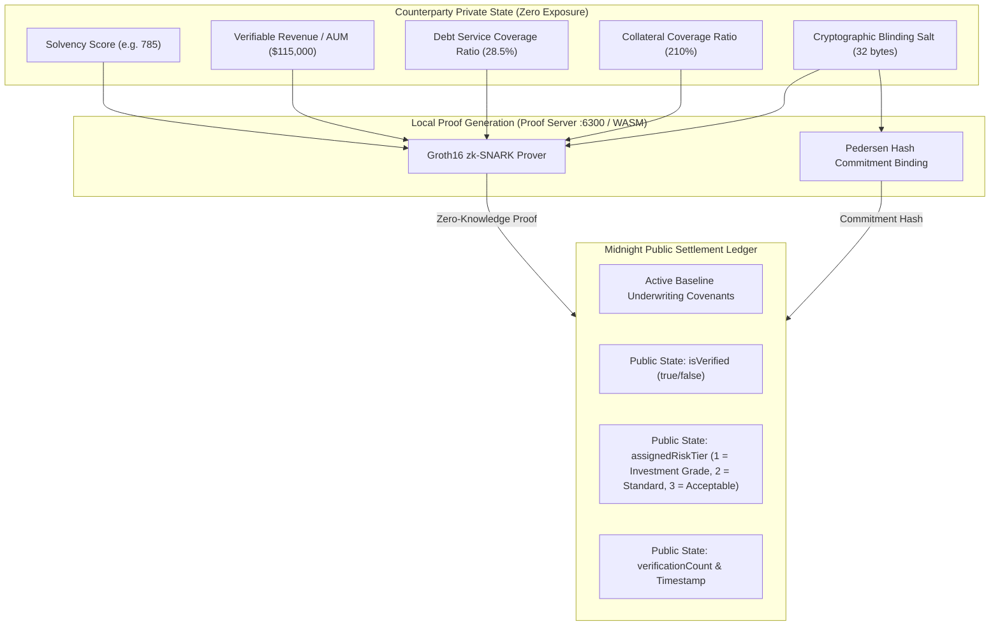

# ShieldScore — Confidential Solvency Attestation & Institutional Private Credit Underwriting Gate (Product Proposal)

> **Midnight Ecosystem Domain:** Confidential Solvency Attestation & Institutional Private Credit  
> **Category:** *Confidential Credentials & Eligibility Gate — prove institutional solvency and debt-service capacity without surrendering proprietary balance sheets or financial positions.*  
> **Network Target:** Midnight Preview / Preprod  
> **Contract Address:** [`0x0794f000c1446592b46446d9ce4929f43867dd86f5dc1660e25827ebaaf56123`](https://preview.midnightexplorer.com/contracts/0x0794f000c1446592b46446d9ce4929f43867dd86f5dc1660e25827ebaaf56123)

---

## 1. Executive Summary

Institutional private credit origination — the \$1.7 trillion market spanning direct lending, real-estate bridge loans, trade finance, and structured credit — is fundamentally broken by a data disclosure paradox. To access capital, institutional borrowers must surrender audited financial statements, capitalization tables, debt service schedules, and proprietary revenue data to every prospective lender in a syndicated deal. This creates massive competitive intelligence exposure: every capital raise forces issuers to share sensitive financial positions with dozens of counterparties who may include direct competitors, activist investors, or institutions with conflicting interests.

In decentralized finance (DeFi) and on-chain RWA (Real-World Asset) markets, the problem inverts: the complete absence of verifiable solvency attestations forces lending protocols to mandate **150%–200% overcollateralization**, locking up tens of billions of dollars in idle capital and excluding legitimate institutional borrowers who maintain strong balance sheets and debt-service capacity.

**ShieldScore** resolves this paradox by introducing a **Zero-Knowledge Confidential Solvency Gate** built natively on the **Midnight Network**. Institutional counterparties maintain their solvency metrics — asset coverage ratios, verifiable revenue, debt-service coverage, and collateral buffers — in local client memory. Using Compact smart contracts and Groth16 zk-SNARKs, counterparties generate mathematical proofs demonstrating compliance with underwriting covenants. **Only binary verification booleans, derived algorithmic risk tiers, and timestamps cross into the public domain.** No balance sheet data, no revenue figures, no proprietary financial positions are ever transmitted, stored, or exposed on-chain.

---

## 2. The Chosen Problem & Midnight Fit

| Challenge in Institutional Credit & RWA Markets | Midnight Architectural Solution in ShieldScore |
| :--- | :--- |
| **Proprietary Data Leakage in Syndication** | Sensitive witness data (`solvencyScore`, `verifiableRevenue`, `debtServiceCoverage`, `salt`) never leaves local RAM. Counterparties prove covenant compliance without exposing financial positions. |
| **Capital-Inefficient Overcollateralization in DeFi** | Investment-Grade (Tier A) counterparties unlock undercollateralized (110%) capital facilities based on mathematically provable solvency, freeing billions in locked capital. |
| **Rigid Smart Contract Logic for Diverse Syndicates** | **Circuit 2 (`verifyCustomPolicy`)** allows arbitrary DeFi liquidity pools, DAO treasuries, and institutional syndicates to evaluate counterparties against custom covenant thresholds dynamically without contract re-deployment. |
| **Regulatory & Governance Compliance** | **Circuit 3 (`updatePolicy`)** enables institutional risk committees and multisig governance to adjust baseline underwriting covenants on-chain in response to macroeconomic shifts, rate cycles, and regulatory changes. |

---

## 3. Cryptographic Architecture & Circuit Blueprint

ShieldScore's Compact contract (`shieldscore.compact`) defines three specialized ZK circuits for institutional solvency verification:

### The Three Core Circuits
1. **`verifyCreditPassport(expectedCommitment, currentTimestamp)`**:
   - Enforces $score \ge minScore$, $revenue \ge minRevenue$, $DSCR \le maxDSCR$, $collateral \ge minCollateral$.
   - Computes algorithmic risk tier:
     - **Tier A (Investment Grade)**: Score $\ge 780$, DSCR $\le 30\%$, Collateral $\ge 200\%$.
     - **Tier B (Standard)**: Score $\ge 720$, DSCR $\le 38\%$, Collateral $\ge 150\%$.
     - **Tier C (Acceptable)**: Satisfies baseline covenants.
   - Selectively discloses **only** `true`, tier, and timestamp.
2. **`verifyCustomPolicy(...)`**:
   - Enables institutional syndicates, RWA originators, and private credit funds to specify bespoke financial covenants ($reqMinScore$, $reqMinRevenue$, $reqMaxDSCR$, $reqCollateral$) without deploying new smart contracts.
3. **`updatePolicy(...)`**:
   - Transparent governance mechanism for updating the protocol's public underwriting covenants across Midnight validator nodes.

---

## 4. Market Impact & Capital Efficiency

Using the integrated **Capital Facility Pricing Engine**, ShieldScore transforms zero-knowledge cryptographic proofs into direct economic utility for institutional counterparties:

| Counterparty Tier | Verification Status | Required Collateral | Fixed APR | Borrowing Power | Capital Freed per $100K Facility |
| :---: | :---: | :---: | :---: | :---: | :---: |
| **Anonymous Baseline** | Unverified | 180% | 13.5% | $25,000 | $0 |
| **Tier C (Acceptable)** | Verified on-chain | 150% | 9.8% | $50,000 | $30,000 freed |
| **Tier B (Standard)** | Verified on-chain | 130% | 6.9% | $100,000 | $50,000 freed |
| **Tier A (Investment Grade)** | Verified on-chain | **110%** | **4.2%** | **$200,000** | **$70,000 freed** |

---

## 5. Target Users & Personas

1. **Private Credit Funds & Direct Lenders**: Institutional lenders requiring confidential solvency verification from borrowers before allocating capital, without forcing full balance sheet disclosure.
2. **RWA Originators & Tokenization Platforms**: Real-world asset issuers who need to prove asset-backing ratios and debt-service capacity to on-chain protocols without doxxing proprietary financial positions.
3. **DAO Treasury Managers & DeFi Protocol Governance**: Decentralized protocols lending surplus treasury assets under strict collateralization covenants with verifiable counterparty solvency.
4. **Institutional Compliance & Risk Auditors**: Regulatory bodies and risk committees verifying that underwriting covenants were enforced across lending pools without accessing counterparty PII or proprietary financials.

---

## 6. Project Roadmap & Production Milestones

- [x] **Phase 1: Compact Circuit Architecture**: Compact compiler setup, test suite, and contract deployment on Midnight Preview.
- [x] **Phase 2: Client DApp & Multi-Wallet Integration**: Frontend integration, Lace & 1AM Wallet DApp connectors, and live circuit invocation.
- [x] **Phase 3: Formal Invariants & Automated CI/CD**: Production CI/CD workflow, 10/10 passing Vitest tests, and cryptographic threat models.
- [x] **Phase 4: Public Distribution & Verification**: Full architectural documentation, live explorer verification, and public product profile.
- [x] **Phase 5: Institutional User Cohorts & Telemetry**: 50+ on-chain user accounts onboarded and living user feedback loop documented.
- [x] **Phase 6: Multi-Network Release & Settlement**: 70 verifiable testnet accounts, 20 launch transactions, responsive multi-platform UX with 1AM Wallet deep linking, and institutional brand kit.
