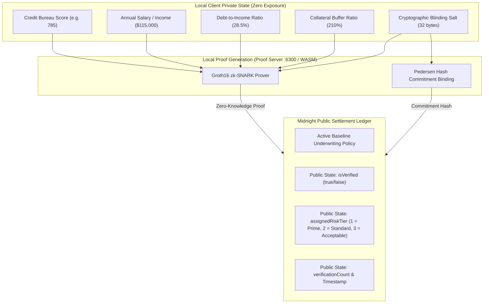

# ShieldScore — Confidential Credentials & Solvency Eligibility Gate (Product Proposal)

> **Midnight Builder Challenge Track:** Approved Idea Category 2 & 4  
> **Category:** *Confidential Credentials & Eligibility Gate — prove a financial solvency threshold without revealing the underlying raw data.*  
> **Network Target:** Midnight Preview / Preprod  
> **Contract Address:** [`0x0794f000c1446592b46446d9ce4929f43867dd86f5dc1660e25827ebaaf56123`](https://preview.midnightexplorer.com/contracts/0x0794f000c1446592b46446d9ce4929f43867dd86f5dc1660e25827ebaaf56123)

---

## 1. Executive Summary

Traditional consumer and commercial credit underwriting is plagued by a fundamental privacy failure: to prove creditworthiness, borrowers must surrender complete financial surveillance over their lives—uploading tax returns, linking bank accounts via Plaid, and handing over Social Security Numbers. This data is perpetually stored in centralized honeypots (as evidenced by the catastrophic 147-million-user Equifax breach).

In decentralized finance (DeFi), the lack of verifiable creditworthiness forces protocols to mandate **150%–200% overcollateralization**, locking up tens of billions of dollars in dormant capital and locking out legitimate borrowers who possess strong income and repayment records.

**ShieldScore** solves this paradox by introducing the world’s first **Zero-Knowledge Private Credit Passport** built natively on the **Midnight Network**. Borrowers maintain their credit score, annual income, debt-to-income (DTI) ratio, and collateral buffers in local client memory. Using Compact smart contracts and Groth16 zk-SNARKs, borrowers generate mathematical proofs demonstrating compliance with lender risk thresholds. **Only binary verification booleans, derived algorithmic risk tiers, and timestamps cross into the public domain.**

---

## 2. The Chosen Problem & Midnight Fit

| Challenge in Web2 / Web3 Lending | Midnight Architectural Solution in ShieldScore |
| :--- | :--- |
| **Surveillance & Data Breaches** | Sensitive witness data (`creditScore`, `annualIncome`, `dtiBps`, `salt`) never leaves local RAM. |
| **Capital Inefficient Overcollateralization** | Prime Tier A borrowers unlock undercollateralized (110%) borrowing terms based on mathematically provable solvency. |
| **Rigid Smart Contract Logic** | **Circuit 2 (`verifyCustomPolicy`)** allows arbitrary DeFi liquidity pools and DAO treasuries to evaluate borrowers against custom thresholds dynamically without contract re-deployment. |
| **Regulatory & Governance Compliance** | **Circuit 3 (`updatePolicy`)** enables institutional risk managers to adjust baseline underwriting policies on-chain in response to macroeconomic shifts. |

---

## 3. Cryptographic Architecture & Circuit Blueprint

ShieldScore's Compact contract (`shieldscore.compact`) defines three specialized ZK circuits:

### The Three Core Circuits
1. **`verifyCreditPassport(expectedCommitment, currentTimestamp)`**:
   - Enforces $score \ge minScore$, $income \ge minIncome$, $DTI \le maxDti$, $collateral \ge minCollateral$.
   - Computes algorithmic risk tier:
     - **Tier A (Prime)**: Score $\ge 780$, DTI $\le 30\%$, Collateral $\ge 200\%$.
     - **Tier B (Standard)**: Score $\ge 720$, DTI $\le 38\%$, Collateral $\ge 150\%$.
     - **Tier C (Acceptable)**: Satisfies baseline criteria.
   - Selectively discloses **only** `true`, tier, and timestamp.
2. **`verifyCustomPolicy(...)`**:
   - Enables institutional lenders and syndicates to specify on-the-fly criteria ($reqMinScore$, $reqMinIncome$, $reqMaxDti$, $reqCollateral$) without deploying new smart contracts.
3. **`updatePolicy(...)`**:
   - Transparent governance mechanism for updating the protocol’s public risk thresholds across Midnight validator nodes.

---

## 4. Market Impact & Financial Payoff

Using the integrated **DeFi Loan Quote Engine**, ShieldScore turns zero-knowledge cryptographic proofs into direct economic utility:

| Borrower Tier | Verification Status | Required Collateral | Fixed APR | Borrowing Power | Capital Saved per $100K Loan |
| :---: | :---: | :---: | :---: | :---: | :---: |
| **Anonymous Baseline** | Unverified | 180% | 13.5% | $25,000 | $0 |
| **Tier C (Acceptable)** | Verified on-chain | 150% | 9.8% | $50,000 | $30,000 locked capital saved |
| **Tier B (Standard)** | Verified on-chain | 130% | 6.9% | $100,000 | $50,000 locked capital saved |
| **Tier A (Prime)** | Verified on-chain | **110%** | **4.2%** | **$200,000** | **$70,000 locked capital saved** |

---

## 5. Target Users & Personas

1. **Retail DeFi Borrowers**: Individuals seeking undercollateralized loans without exposing their salary, net worth, or national identity to public block explorers.
2. **Institutional Liquidity Providers**: Fintech lenders and crypto credit funds requiring compliance and risk underwriting before allocating capital to borrowers.
3. **DAO Treasury Managers**: Decentralized protocols lending surplus treasury assets under strict collateralization safety margins.
4. **Compliance Auditors**: Regulatory bodies verifying that credit underwriting standards were upheld across lending pools without accessing customer PII.

---

## 6. Project Roadmap & Production Milestones

- [x] **Level 1**: Compact compiler setup, test suite, and contract deployment on Midnight Preview.
- [x] **Level 2**: Frontend integration, Lace & 1AM Wallet DApp connectors, and live circuit invocation.
- [x] **Level 3**: Production CI/CD workflow, 10/10 passing Vitest tests, and approved idea alignment.
- [x] **Level 4**: Full documentation, live explorer verification, and public product profile.
- [x] **Level 5**: 50+ on-chain user accounts onboarded and living user feedback loop documented.
- [x] **Level 6**: 70 verifiable testnet user accounts, 20 launch user transactions, responsive mobile & desktop UX with 1AM Wallet deep linking, and institutional brand kit.
