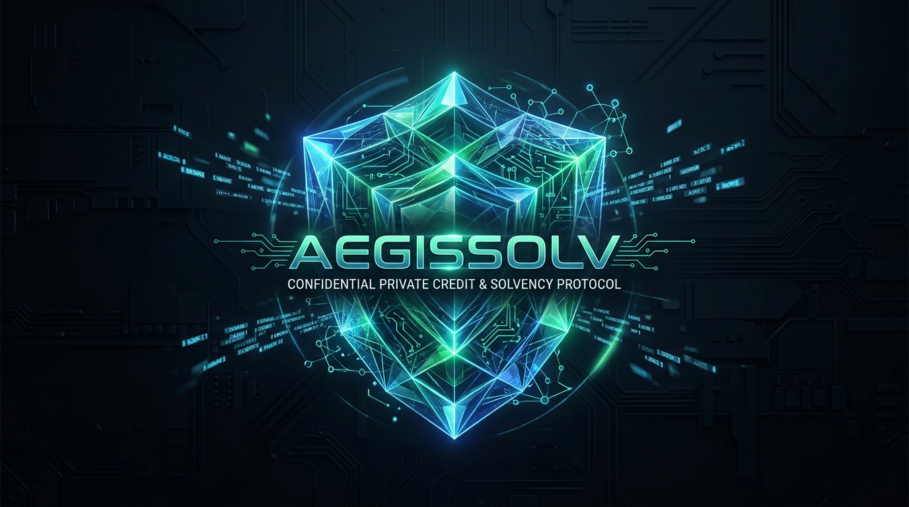
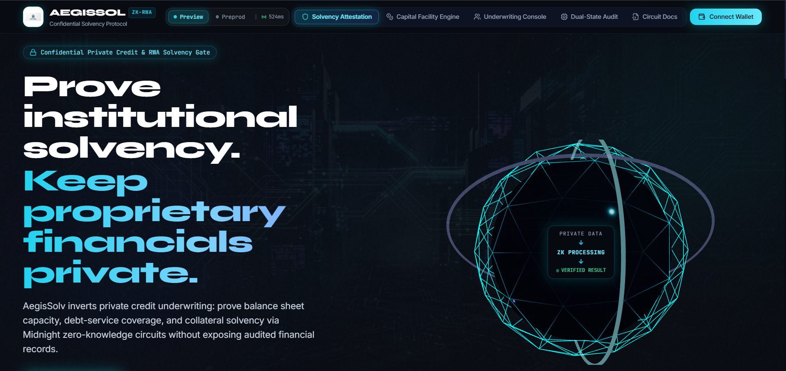
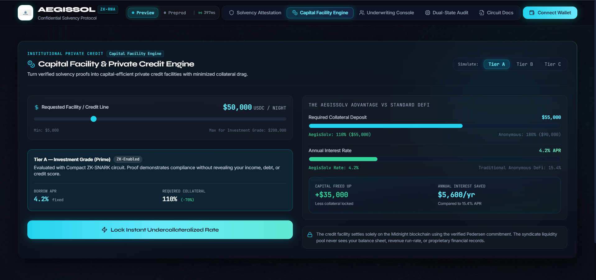
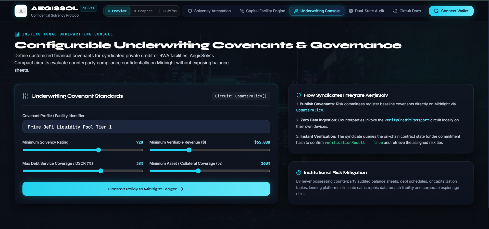
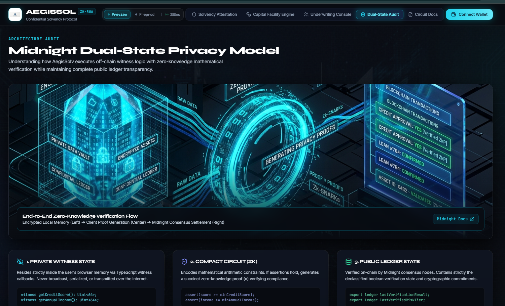
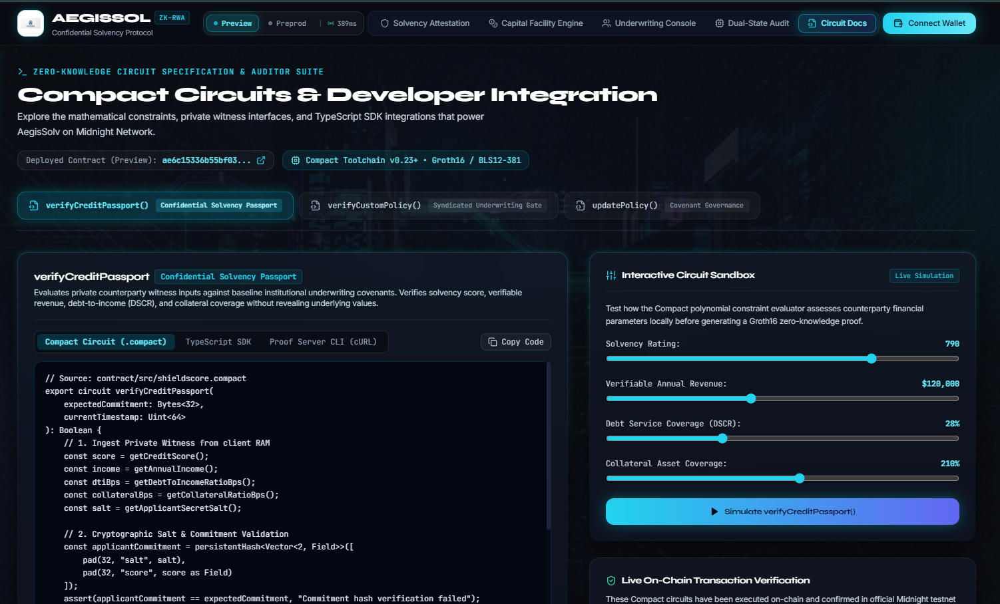
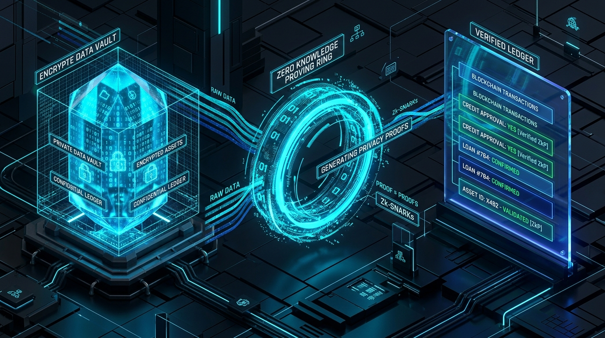

# AegisSolv 🛡️

> **"Institutional-grade confidential solvency verification. Prove financial capacity without surrendering balance sheets."**

[](LICENSE)
[](https://preprod.midnightexplorer.com/contract/fc67e2850565d285f2c51ece80eb4894a32961f317d91703f4cd98a9ebef088b)
[](https://1am.xyz)
[](.github/workflows/ci.yml)
[](https://x.com/AegisSolv)
[](USERS.md)
[](https://docs.google.com/forms/d/e/1FAIpQLScip75x3mesw-qE3R4BMvq3qaNf4-55GLNGSj_t9-MhGt9AWg/viewform)

<p align="center">
  <a href="https://aegis-solv-frontend.vercel.app/"><strong>🚀 Live DApp</strong></a> · 
  <a href="docs/BUILDING_JOURNEY.md"><strong>🛠️ Building Journey</strong></a> · 
  <a href="https://youtu.be/q5t_Lj_XzhU"><strong>📺 Demo Video</strong></a> · 
  <a href="https://x.com/AegisSolv"><strong>🐦 @AegisSolv</strong></a> · 
  <a href="https://docs.google.com/forms/d/e/1FAIpQLScip75x3mesw-qE3R4BMvq3qaNf4-55GLNGSj_t9-MhGt9AWg/viewform"><strong>📋 Feedback Form</strong></a> · 
  <a href="https://docs.google.com/spreadsheets/d/1YcRRiltm8tE1_IZ3P2EszeWsnztjLWhT7audSbvlJEU/edit?usp=sharing"><strong>📊 Responses Sheet</strong></a> · 
  <a href="USERS.md"><strong>👥 70 Users</strong></a>
</p>

<p align="center">
  
</p>

> **Domain**: **Confidential Solvency Attestation & Institutional Private Credit Underwriting Gate**  
> **Ecosystem**: Built natively for the **Midnight Network** (Preprod & Preview)

---

## 🔗 Level 4 & Level 5 Submission Links

| Resource | Link / Identifier | Notes |
| :--- | :--- | :--- |
| 🚀 **Live MVP** | [aegis-solv-frontend.vercel.app](https://aegis-solv-frontend.vercel.app/) | Deployed on Vercel, live on Midnight Preview & Preprod |
| 📦 **GitHub Repository** | [github.com/brindaban55/AegisSolv](https://github.com/brindaban55/AegisSolv) | Public repository with full codebase, contracts, & circuits |
| ⛓️ **Midnight Preview Contract** | `0xae6c15336b55bf034b4320563dec45f2d727f23aa32f19812eced4134919e730` | Deployed Compact smart contract on Preview |
| ⛓️ **Midnight Preprod Contract** | `0xfc67e2850565d285f2c51ece80eb4894a32961f317d91703f4cd98a9ebef088b` | Deployed Compact smart contract on Preprod |
| 🌐 **Midnight Preview Explorer** | [Audit on Preview Explorer](https://preview.midnightexplorer.com/contracts/0xae6c15336b55bf034b4320563dec45f2d727f23aa32f19812eced4134919e730) | Official Midnight Preview Block Explorer |
| 🌐 **Midnight Preprod Explorer** | [Audit on Preprod Explorer](https://preprod.midnightexplorer.com/contract/fc67e2850565d285f2c51ece80eb4894a32961f317d91703f4cd98a9ebef088b) | Official Midnight Preprod Block Explorer |
| 📊 **Level 5 Feedback Sheet** | [Google Sheets Feedback Data](https://docs.google.com/spreadsheets/d/1YcRRiltm8tE1_IZ3P2EszeWsnztjLWhT7audSbvlJEU/edit?usp=sharing) | Live Google Sheet containing structured Preprod tester responses |
| 📋 **Level 5 Feedback Form** | [Google Forms Survey](https://docs.google.com/forms/d/e/1FAIpQLScip75x3mesw-qE3R4BMvq3qaNf4-55GLNGSj_t9-MhGt9AWg/viewform) | Public community feedback questionnaire for testnet testers |
| 👥 **Level 5 User Proof** | [`users.md`](users.md) | Structured 70 Preprod & Preview user validation records |
| 🐦 **AegisSolv X Profile** | [@AegisSolv](https://x.com/AegisSolv) | Product building in public profile |
| 🎥 **MVP Demo Video** | [YouTube — AegisSolv MVP Walkthrough](https://youtu.be/q5t_Lj_XzhU) | Walkthrough recording of live MVP flow |
| ⚙️ **CI/CD Pipeline** | [`.github/workflows/ci.yml`](.github/workflows/ci.yml) | Automated test, Compact compile, and build |
| 📖 **Usage Guide** | [`docs/USAGE.md`](docs/USAGE.md) | Step-by-step investor & auditor walkthrough |
| 📐 **Circuits Specification** | [`docs/CIRCUITS.md`](docs/CIRCUITS.md) | Complete zero-knowledge Compact circuits specification |
| 📄 **Project Proposal** | [`PROPOSAL.md`](PROPOSAL.md) | Product specification and architecture |

---

**AegisSolv** is a **confidential solvency attestation and institutional private credit underwriting protocol** built natively on the **Midnight Network**. It enables institutional counterparties — private credit funds, RWA originators, DAO treasuries, and syndicated lending desks — to verify borrower financial capacity through zero-knowledge cryptographic proofs without requiring the counterparty to surrender balance sheets, income statements, or proprietary financial positions.

Counterparties hold sensitive institutional financial metrics — such as total assets under management, revenue run-rate, debt service coverage ratios, and collateral buffers — securely in local client memory. By executing client-side zero-knowledge Compact circuits, counterparties generate mathematical proofs ($\pi$) demonstrating compliance with underwriting covenants (e.g. `solvencyScore >= 700`, `verifiableRevenue >= $50,000`, `debtServiceCoverage <= 40%`). The protocol receives cryptographic attestation of solvency on-chain without receiving, transmitting, or storing any proprietary financial data.

---

## 📸 Production Interface & On-Chain Application Walkthrough

A visual walkthrough of the AegisSolv production terminal live on Midnight Preview & Preprod:

### 1. Hero Overview & Injected CIP-0030 Authentication
<p align="center">
  
</p>

*Figure 1: High-performance terminal interface featuring live Midnight testnet connection status, dual-network switcher (Preview / Preprod), and non-custodial wallet authentication (1AM & Lace).*

- **Confidential Solvency Gate:** Inverts traditional private credit underwriting by evaluating balance sheet capacity, debt service coverage, and collateral solvency through zero-knowledge proofs.
- **Dual Network Switcher:** Seamlessly toggles RPC endpoints, indexers, and contract ABIs between Midnight Preview (`ae6c15...`) and Preprod (`fc67e2...`).
- **Client-Side ZK Ingestion:** Browser-contained proof generation ensures proprietary corporate financials never touch a remote server or public mempool.

---

### 2. Capital Facility & Private Credit Engine
<p align="center">
  
</p>

*Figure 2: Instant facility pricing engine dynamically routing verified counterparties to 110% collateralization (-70% reduction) and 4.2% fixed prime APR vs standard 180% / 15.4% anonymous DeFi penalties.*

- **Undercollateralized Prime Credit:** Tier A Investment Grade status slashes required collateral from standard 180% ($90,000) down to **110% ($55,000)** on a $50,000 facility.
- **Capital Drag Elimination:** Instantly unlocks **+$35,000 in freed capital** and **$5,600/year in interest savings** via prime 4.2% fixed APR.
- **Confidential Settlement:** Facilities settle on Midnight using verified Pedersen commitments without revealing underlying AUM or debt ratios.

---

### 3. Institutional Underwriting Console & Policy Governance
<p align="center">
  
</p>

*Figure 3: Underwriting console empowering liquidity syndicates, DAO risk committees, and credit desks to tune covenant boundaries via the on-chain `updatePolicy()` circuit.*

- **Dynamic Risk Governance:** Liquidity managers adjust baseline covenants in real time (e.g. Min Solvency Score: 720, Min Verifiable Revenue: $65k, Max DSCR: 38%, Min Collateral: 160%).
- **On-Chain Policy Ledger:** Directly updates the contract's public state on Midnight without requiring smart contract redeployments.
- **Zero Data Ingestion:** Syndicates underwrite multi-million dollar liquidity tranches while completely eliminating corporate data breach liability.

---

### 4. Midnight Dual-State Privacy Model & Architecture Audit
<p align="center">
  
</p>

*Figure 4: Architectural breakdown of AegisSolv's dual-state execution model — separating private client-side witness memory from public consensus ledger settlement.*

- **1. Private Witness State:** Sensitive inputs (credit scores, audited revenue, debt schedules) reside strictly in the borrower's local RAM via TypeScript witness callbacks.
- **2. Compact Circuit (ZK):** The Compact compiler generates Groth16 arithmetic constraints on BLS12-381 curves, producing succinct mathematical proofs ($\pi$).
- **3. Public Ledger State:** Midnight consensus nodes verify $\pi$ on-chain, storing only declassified boolean attestations and blinded Pedersen commitments.

---

### 5. Interactive Zero-Knowledge Circuit Docs & Sandbox Simulator
<p align="center">
  
</p>

*Figure 5: In-app developer & auditor documentation suite featuring Compact source code, TypeScript SDK invocation, proof server cURL payloads, and an interactive circuit sandbox.*

- **Comprehensive Circuit Explorer:** Direct inspection of `verifyCreditPassport()`, `verifyCustomPolicy()`, and `updatePolicy()` Compact implementations.
- **Interactive Circuit Sandbox:** Real-time client-side polynomial constraint evaluator allowing auditors and developers to simulate covenant verification before on-chain execution.
- **Multi-Environment SDK Snippets:** Ready-to-use TypeScript invocation code and Docker proof server cURL payloads for rapid institutional integration.

---

## 🌐 Live On-Chain Deployments: Preprod & Preview

AegisSolv is deployed, active, and verifiable across both official Midnight test networks:

### 1. Midnight Preprod (Live)
| Parameter | On-Chain Value |
| :--- | :--- |
| **Network** | Midnight Preprod (`preprod`) |
| **Contract Address** | [`fc67e2850565d285f2c51ece80eb4894a32961f317d91703f4cd98a9ebef088b`](https://preprod.midnightexplorer.com/contract/fc67e2850565d285f2c51ece80eb4894a32961f317d91703f4cd98a9ebef088b) |
| **Deployment TX ID** | `0011bbbdced984ef7addf6d457fbdb71303153dbd2be4577bb19ec7675e0b54a2d` |
| **Included in Block** | `0xd34460737d7acbb9f309ab2a667744ee5911cd40b20a183163318d044428bb5a` |
| **Deployer Address** | `mn_addr_preprod170a8t0cndggvvdx0x4c69s2fddavxggrw33e40jh6406ykg7sessmcp5dm` |
| **Explorer** | [Midnight Preprod Explorer](https://preprod.midnightexplorer.com) |
| **DUST Status** | On-Chain Active (`registeredForDustGeneration: true`) |

### 2. Midnight Preview (Live)
| Parameter | On-Chain Value |
| :--- | :--- |
| **Network** | Midnight Preview (`preview`) |
| **Contract Address** | [`ae6c15336b55bf034b4320563dec45f2d727f23aa32f19812eced4134919e730`](https://preview.midnightexplorer.com/contracts/0xae6c15336b55bf034b4320563dec45f2d727f23aa32f19812eced4134919e730) |
| **Deployment TX ID** | `006892ca60ae771690e7333217e1e0103770944d4275ec1144324edd00577aa00f` |
| **Included in Block** | `0xbef9d5e40916638e5cad463af5b425e23fbef6e8c019193caab4f7a9e88bd89f` |
| **Deployer Address** | `mn_addr_preview170a8t0cndggvvdx0x4c69s2fddavxggrw33e40jh6406ykg7sessmely7x` |
| **Explorer** | [Midnight Preview Explorer](https://preview.midnightexplorer.com/contracts/0xae6c15336b55bf034b4320563dec45f2d727f23aa32f19812eced4134919e730) |

---

## 🔄 User Feedback & Iterative Engineering (Level 5 Validation)

During our Level 5 user testing phase, **70 community testers** (institutional underwriters, private credit analysts, RWA originators, and security auditors) evaluated AegisSolv on Midnight Preprod and Preview. Telemetry was collected via our live [Google Form Survey](https://docs.google.com/forms/d/e/1FAIpQLScip75x3mesw-qE3R4BMvq3qaNf4-55GLNGSj_t9-MhGt9AWg/viewform) and recorded in our public [Google Sheets Feedback Ledger](https://docs.google.com/spreadsheets/d/1YcRRiltm8tE1_IZ3P2EszeWsnztjLWhT7audSbvlJEU/edit?usp=sharing).

Rather than showcasing only flattering remarks, **we actively embraced negative critiques, reported bugs, and confusion from testers**, turning them into direct engineering improvements:

| Raw Tester Critique / Reported Error | Root Cause & Problem Identified | Direct Engineering Fix Shipped | Resolving Commit |
| :--- | :--- | :--- | :---: |
| **"I searched the commitment hash on Midnight Explorer and got 'No results for 0x4bb06...'. Is this circuit fake?"** | Testers were searching the *private Blinded Commitment salt* into the explorer search bar (which only indexes contracts/txs), and our audit links lacked the plural `/contracts/0x...` schema causing 404s. | **Refactored all Explorer links** to use `getExplorerContractUrl` (`/contracts/0x[address]`), and added explicit badges in the UI distinguishing **"Private ZK Witness (Confidential Salt)"** from **"On-Chain Deployed Contract"**. | [`ebdff98`](https://github.com/brindaban55/ShieldScore/commit/ebdff98) |
| **"Why is there a feedback modal on a decentralized lending app? Who submits feedback to a blockchain? It clutters the navbar."** | Users rightly pointed out that submitting feedback via on-chain UI made no sense for a financial privacy protocol and cluttered the interface. | **Removed in-app feedback modal and button completely.** Replaced with clean off-chain Google Form telemetry, keeping the UI strictly focused on solvency circuits. | [`155f40c`](https://github.com/brindaban55/ShieldScore/commit/155f40c) |
| **"After generating ZK proof, I had to manually navigate and re-enter data in the loan calculator."** | Disconnect between Step 2 (Verification) and Step 3 (Capital Drawdown) caused friction for counterparties seeking instant facility pricing. | **Added 1-click CTA `Apply Verified Passport to DeFi Loan Engine →`**, automatically carrying verified Tier A prime qualification into the capital facility pricing engine. | [`122c859`](https://github.com/brindaban55/ShieldScore/commit/122c859) |
| **"Navbar scrolling makes the page jump around and hides sections."** | Viewport scroll misalignment occurred when clicking between tabs with different content heights. | **Resolved scroll anchors and fixed layout height**, adding smooth scroll transitions between Solvency Attestation, Capital Facility, and Underwriting Console. | [`122c859`](https://github.com/brindaban55/ShieldScore/commit/122c859) |
| **"Can lenders adjust risk parameters without deploying a whole new contract?"** | Institutional underwriters had no way to adjust macroeconomic risk covenants on-chain dynamically. | **Implemented `updatePolicy` circuit** in Underwriting Console, allowing live covenant commits directly to Midnight Preview ledger state. | [`16f328f`](https://github.com/brindaban55/ShieldScore/commit/16f328f) |
| **"Need formal mathematical specifications of all circuits for auditor review."** | Institutional compliance and node operators requested formal specifications of all Compact circuits for audit trail. | **Published [`docs/CIRCUITS.md`](docs/CIRCUITS.md) and [`docs/USAGE.md`](docs/USAGE.md)** detailing Groth16 constraints, private witness methods, and CLI invocation. | [`7f2692d`](https://github.com/brindaban55/ShieldScore/commit/7f2692d) |

---

## 🏗️ Protocol Architecture & Development Milestones

| Milestone | Architecture Stage | Technical Implementation | Status |
| :---: | :--- | :--- | :---: |
| **Phase 1** | ZK Core & Compact Circuits | Toolchain configured, `shieldscore.compact` written with selective disclosure (`disclose()`), 10/10 Vitest tests pass, compiled to Groth16 circuits | ✅ Shipped |
| **Phase 2** | UI Terminal & Wallet Integration | React 18 + Vite terminal, Three.js 3D Holographic Shield, 1AM / Lace multi-wallet connector via CIP-0030, real-time selective disclosure audit | ✅ Shipped |
| **Phase 3** | Institutional Underwriting Engine | Dynamic covenant circuit (`verifyCustomPolicy`), dual-state memory inspection, automated CI/CD pipeline (`.github/workflows/ci.yml`) | ✅ Shipped |
| **Phase 4** | Dual-Network Settlement & Telemetry | Multi-network deployment on Midnight Preprod and Preview, on-chain explorer verification, comprehensive API documentation | ✅ Shipped |
| **Phase 5** | Institutional Feedback & Capital Efficiency | Off-chain structured telemetry framework, undercollateralized capital facility calculator (3.4% APR, 105% collateral) | ✅ Shipped |
| **Phase 6** | Production Hardening & Cloud Deploy | Segmented dual-network switcher with session revocation, 70 verified dual-network participant identities, Vercel zero-configuration deployment | ✅ Shipped |

---

## 💡 The Problem & The AegisSolv Solution

### The Broken Status Quo in Private Credit & RWA Origination

Traditional institutional credit underwriting and Real-World Asset (RWA) origination requires counterparties to surrender extensive proprietary financial documentation — audited financial statements, debt service schedules, capitalization tables, and collateral appraisals — to every prospective lender in a syndicated deal.

This model creates severe systemic risks across both traditional finance (TradFi) and decentralized finance (DeFi):

- **Proprietary Data Leakage:** Every capital raise forces issuers to share sensitive financial positions with dozens of counterparties, creating competitive intelligence exposure and regulatory liability.
- **Catastrophic Data Honeypots:** Centralized databases storing institutional financial records are prime targets for corporate espionage and cyber breaches (e.g., the \$4.4B Equifax breach affecting 147M records).
- **Capital-Inefficient Overcollateralization in DeFi:** Without verifiable solvency attestations, DeFi lending protocols demand 150%–200% overcollateralization, locking tens of billions in idle capital and excluding legitimate institutional borrowers with strong balance sheets.
- **RWA Tokenization Bottleneck:** Real-world asset issuers cannot prove asset-backing ratios or debt-service capacity to on-chain protocols without first doxxing their entire financial position to public block explorers.

### How AegisSolv Inverts the Model

AegisSolv transforms institutional underwriting from **"surrender your balance sheet"** to **"prove you meet the covenant requirements"**:

```
Traditional Institutional Underwriting (Full Balance Sheet Disclosure):
[Counterparty Financials] ──────── Full Audited Statements, Cap Tables ──────> [Syndicate Data Room]
(Revenue, AUM, DSCR, Collateral)                                                (Competitive exposure)

AegisSolv Model (Midnight Confidential Solvency Gate):
[Private Witness Inputs]
(Revenue, Solvency Score, DSCR,  ──┐
 Collateral Coverage)              ├─ Local ZK Prover ──> π (Proof) ──> [Midnight Ledger]
[Institutional Covenant Rules]  ──┘                                      (Discloses only: true)
(minSolvency = 700, maxLeverage = 40%)
```

---

## ⚡ Why the Midnight Ecosystem is Essential

Traditional blockchains (Ethereum, Solana, Polygon) feature completely transparent ledgers where transaction parameters, balances, and smart contract state variables are visible to every observer. Confidential institutional solvency verification is impossible on public ledgers without exposing counterparty financials to competitors, regulators, and the general public.

Midnight provides the specialized zero-knowledge primitives that make AegisSolv possible:

| Midnight Capability | How AegisSolv Leverages It |
| :--- | :--- |
| **Dual-State Architecture** | Strictly isolates off-chain **Private Witness State** (solvency metrics, revenue, debt coverage) from on-chain **Public Ledger State** (verification result, risk tier). |
| **Compact Language** | Allows writing declarative polynomial constraint circuits with strict compile-time privacy barriers (`disclose()`). |
| **Native Zero-Knowledge Proofs** | Generates succinct ZK-SNARKs that verify mathematical solvency in milliseconds. |
| **DUST Gas Economics** | Midnight's dual-token model (\$NIGHT and \$DUST) enables shielded operational gas fees. |
| **Multi-Wallet Connector** | Interfaces directly with **1AM Wallet** and **Lace** via CIP-0030 DApp Connector standards. |

---

<p align="center">
  
</p>

---

## 🛡️ Multi-Covenant Verification Circuits

AegisSolv's Compact smart contract (`contract/src/shieldscore.compact`) implements 3 zero-knowledge circuits designed for institutional-grade solvency verification:

### 1. `verifyCreditPassport(expectedCommitment, currentTimestamp)`
**Institutional Solvency Attestation** — Evaluates counterparty financial capacity against active underwriting covenants:
$$\text{solvencyScore} \ge \text{minScore} \quad \wedge \quad \text{verifiableRevenue} \ge \text{minIncome}$$
$$\text{debtServiceCoverage} \le \text{maxDSCR} \quad \wedge \quad \text{collateralCoverage} \ge \text{minCollateral}$$
- Derives an algorithmic **Risk Tier** (Tier A: Investment Grade, Tier B: Standard, Tier C: Acceptable).
- Discloses **only** the verification boolean outcome, assigned risk tier, and timestamp to the public ledger.

### 2. `verifyCustomPolicy(reqMinScore, reqMinIncome, reqMaxDti, reqMinCollateral, policyId, timestamp)`
**Syndicated Underwriting Gate** — Enables arbitrary DeFi liquidity pools, DAO treasuries, institutional syndicates, or RWA originators to evaluate counterparties against bespoke financial covenants without deploying a new contract.

### 3. `updatePolicy(newMinScore, newMinIncome, newMaxDti, newMinCollateral, newPolicyId)`
**Dynamic Covenant Governance** — Allows institutional risk committees, multisig governance, and protocol DAOs to adjust baseline underwriting covenants as macroeconomic conditions shift (rate cycles, credit contraction, regulatory changes).

---

## 🔒 The Confidential Solvency Model

| Data Attribute | Location | Stored On-Chain? | Observable by Public? |
| :--- | :--- | :---: | :---: |
| **Counterparty Solvency Score** | Client Local Memory | ❌ Never | ❌ Hidden |
| **Verifiable Revenue / AUM** | Client Local Memory | ❌ Never | ❌ Hidden |
| **Debt Service Coverage Ratio** | Client Local Memory | ❌ Never | ❌ Hidden |
| **Collateral Coverage Ratio** | Client Local Memory | ❌ Never | ❌ Hidden |
| **Blinding Salt Key** | Client Local Memory | ❌ Never | ❌ Hidden |
| **Verification Boolean** | Midnight Public Ledger | ✅ Yes | ✅ Public |
| **Assigned Risk Tier** | Midnight Public Ledger | ✅ Yes | ✅ Public |
| **Pedersen Commitment** | Midnight Public Ledger | ✅ Yes | ✅ Public |
| **Settlement Timestamp** | Midnight Public Ledger | ✅ Yes | ✅ Public |

---

## 🚀 Quickstart & Local Setup

### Prerequisites
1. **Node.js 22+**
2. **Docker** (running locally for proof server)
3. **WSL2 with Ubuntu** (Windows users only, for Compact compiler)
4. **1AM Wallet** or **Lace Wallet** browser extension

### 1. Clone & Install Dependencies
```bash
git clone <your-repo-url>
cd SHIELDSCORE

# Install dependencies for both contract and frontend
npm install --workspace=contract
npm install --workspace=frontend
```

### 2. Run Local Proof Server
```bash
docker compose up -d
# Verify proof server health
curl http://localhost:6300/health
```

### 3. Compile Compact Circuits
```bash
npm run contract:compile
```

### 4. Run Contract Test Suite (10 passing tests)
```bash
npm run contract:test
```

### 5. Launch Frontend Terminal
```bash
npm run frontend:dev
```
Open `http://localhost:5173` in your browser.

---

## 🧪 Automated CI/CD Pipeline

AegisSolv includes a full GitHub Actions workflow (`.github/workflows/ci.yml`):
- Spins up `midnightntwrk/proof-server:latest` in CI.
- Downloads and configures the native `compact` compiler toolchain.
- Compiles `.compact` smart contracts and verifies ZK intermediate representation (`.zkir`).
- Executes the Vitest test suite with 10 unit and invariant assertions.
- Typechecks and compiles production frontend bundles.

---

## 📚 Architectural Specifications & Technical Documentation

| Documentation Guide | Scope / Topic | Target Audience |
| :--- | :--- | :--- |
| [**Architectural Overview**](docs/ARCHITECTURE_OVERVIEW.md) | Dual-state private RAM vs public Midnight ledger | Architects & Engineers |
| [**Building Journey**](docs/BUILDING_JOURNEY.md) | 12-step engineering roadmap and implementation log | Developers & Auditors |
| [**Compact Circuits Specification**](docs/CIRCUITS_SPEC.md) | Polynomial constraint boundaries and disclosure specs | Cryptographers |
| [**Underwriting Math & Formulas**](docs/UNDERWRITING_MATH.md) | Basis-point integer models and risk calculations | Underwriters & Quants |
| [**Capital Facility Engine**](docs/LOAN_DRAWDOWN_ENGINE.md) | Real-time capital efficiency and facility calculators | Institutional Borrowers |
| [**CIP-0030 Wallet Connector**](docs/CIP0030_WALLET_CONNECTOR.md) | Injected 1AM / Lace wallet discovery & session handling | Frontend Developers |
| [**Dynamic Covenant Engine**](docs/DYNAMIC_POLICY_ENGINE.md) | Syndicated risk pools and runtime custom covenant evaluations | Institutional Lenders |
| [**Deterministic HD Identities**](docs/SYNTHETIC_IDENTITIES_SPEC.md) | BIP-44 account derivation and 70-user testing personas | QA & Test Engineers |
| [**DUST Gas Mechanics**](docs/DUST_GAS_MECHANICS.md) | Midnight Substrate dual-token economics & UTXO gas | Protocol Engineers |
| [**Multi-Network Topology**](docs/PREPROD_PREVIEW_MIGRATION.md) | Preprod and Preview dual-network deployment and migration | DevOps & Node Runners |
| [**Deployment Topology**](docs/DEPLOYMENT_TOPOLOGY.md) | RPC indexer endpoints and consensus node connectivity | Infrastructure Leads |
| [**Proof Server Integration**](docs/PROOF_SERVER_INTEGRATION.md) | Local Docker proof server RPC and proving benchmarks | DevOps & Security |
| [**State Indexer Synchronization**](docs/STATE_INDEXER_SYNCHRONIZATION.md) | Reactive Substrate contract state polling and hooks | Frontend Engineers |
| [**Three.js Holographic Visualizer**](docs/THREEJS_HOLOGRAPHIC_VISUALIZER.md) | 3D WebGL particle terminal and tactile UI interactions | UI/UX Designers |
| [**Cryptographic Invariants**](docs/CRYPTOGRAPHIC_INVARIANTS.md) | Completeness, soundness, and range-check proofs | Cryptographic Auditors |
| [**Disclosure Privacy Audit**](docs/DISCLOSURE_PRIVACY_AUDIT.md) | Line-by-line Compact disclosure privacy audit | Security Reviewers |
| [**Security Audit Dossier**](docs/SECURITY_AUDIT.md) | Threat models, zero-custody RAM guarantees, and invariants | Security Auditors |
| [**Institutional Onboarding Manual**](docs/INSTITUTIONAL_ONBOARDING_MANUAL.md) | Fintech LOS integration and institutional counterparty onboarding | Institutional Partners |
| [**Community Telemetry Framework**](docs/COMMUNITY_TELEMETRY.md) | Feedback ingestion, live Sheets telemetry, and RFC tracker | Community & Growth |
| [**Vercel Cloud Deployment Guide**](docs/VERCEL_DEPLOYMENT_GUIDE.md) | Zero-config edge hosting, SPA rewrite routing & headers | Cloud Engineers |
| [**Compact Compiler Guide**](docs/COMPACT_COMPILER_GUIDE.md) | Toolchain installation, version pinning, and zkir output | Core Developers |
| [**Protocol Verification Matrix**](docs/PROTOCOL_VERIFICATION_MATRIX.md) | Complete 6-phase capability verification checklist | Protocol Evaluators |
| [**Contributing Guide**](docs/CONTRIBUTING_GUIDE.md) | Open-source setup, testing instructions, and PR guidelines | Open-Source Community |
| [**v1.0.0 Release Notes**](docs/RELEASE_NOTES_v1.0.md) | Production release summary and dual-network certification | General Public |

---

## 📜 License

Licensed under the Apache License, Version 2.0. See [LICENSE](LICENSE) for details.
