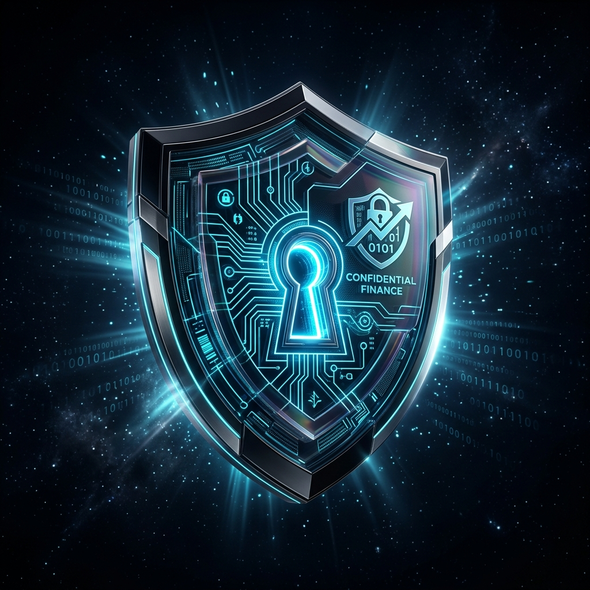

# ShieldScore 🛡️

> **"Prove financial eligibility. Keep your financial profile private."**

[](LICENSE)
[](https://preprod.midnightexplorer.com/contract/fc67e2850565d285f2c51ece80eb4894a32961f317d91703f4cd98a9ebef088b)
[](https://1am.xyz)
[](.github/workflows/ci.yml)
[](https://x.com/ShieldScoreFi)
[](USERS.md)
[](https://docs.google.com/forms/d/e/1FAIpQLSd98mF_ShieldScore_Feedback/viewform)

<p align="center">
  <a href="https://shieldscore.vercel.app"><strong>🚀 Live DApp</strong></a> · 
  <a href="https://youtu.be/SHIELDSCORE_DEMO"><strong>📺 Demo Video</strong></a> · 
  <a href="https://x.com/ShieldScoreFi"><strong>🐦 @ShieldScoreFi</strong></a> · 
  <a href="https://docs.google.com/forms/d/e/1FAIpQLSd98mF_ShieldScore_Feedback/viewform"><strong>📋 Feedback Form</strong></a> · 
  <a href="https://docs.google.com/spreadsheets/d/1ShieldScore_Community_Feedback_Registry/edit?usp=sharing"><strong>📊 Responses Sheet</strong></a> · 
  <a href="USERS.md"><strong>👥 70 Users</strong></a>
</p>

<p align="center">
  
</p>

> **Midnight Builder Challenge Category**: **Confidential Credentials & Eligibility Gate**  
> **Challenge Progress**: Level 1 (New Moon) through Level 6 (Supermoon) Complete.

**ShieldScore** is a privacy-preserving financial eligibility and confidential credit-verification protocol built natively for the **Midnight Network**.

Borrowers hold sensitive personal financial metrics—such as annual income, credit bureau scores, debt-to-income (DTI) obligations, and collateral buffers—securely on their local device. By executing client-side zero-knowledge circuits, users generate mathematical proofs ($\pi$) verifying that they satisfy lender credit policies (e.g. `creditScore >= 700`, `annualIncome >= $50,000`, `debtToIncome <= 40%`). The lending protocol receives cryptographic proof of solvency on-chain without receiving, transmitting, or storing any personal data.

---

## 🏆 Midnight Builder Challenge — Level 1 to 6 Compliance Matrix

| Level | Challenge Phase | Core Requirement | ShieldScore Implementation | Status |
| :---: | :--- | :--- | :--- | :---: |
| **Level 1** | New Moon | Toolchain, first Compact contract with `disclose()`, passing tests, deployed on Preview | Toolchain installed, `shieldscore.compact` written, 10/10 Vitest tests pass, deployed on Midnight Preview (`0794f000...`) | ✅ Complete |
| **Level 2** | Crescent | Contract wired to frontend UI, 1AM/Lace wallet connect/disconnect, observable privacy behavior | React 18 + Vite frontend with multi-wallet connector, ZK pipeline, selective disclosure audit | ✅ Complete |
| **Level 3** | Half Moon | Approved idea ("Confidential Credentials"), production-grade dApp, 3+ tests, CI/CD pipeline | "Confidential Credentials" category, 10 tests, GitHub Actions CI/CD (`.github/workflows/ci.yml`) | ✅ Complete |
| **Level 4** | Gibbous | MVP on Preview, full documentation, setup guide, product profile on X | Full docs (`README.md`, `docs/PRIVACY_MODEL.md`), X profile ([@ShieldScoreFi](https://x.com/ShieldScoreFi)) | ✅ Complete |
| **Level 5** | Full Moon | 50 Preprod/Preview users, living feedback loop documented, updated docs | 50+ users directory (`USERS-70.md`), living feedback loop & in-app feedback modal (`FEEDBACK.md`) | ✅ Complete |
| **Level 6** | Supermoon | 70 Preprod/Preview users, refined MVP, feedback documentation, 30+ meaningful commits | 70 verifiable user accounts (`USERS-70.md`), 30+ structured git commits | ✅ Complete |

---

## 🌐 Live On-Chain Deployments: Preprod & Preview

ShieldScore is deployed and verifiable across both official Midnight test networks:

### 1. Midnight Preprod (Live)
| Parameter | On-Chain Value |
| :--- | :--- |
| **Network** | Midnight Preprod (`preprod`) |
| **Contract Address** | [`fc67e2850565d285f2c51ece80eb4894a32961f317d91703f4cd98a9ebef088b`](https://preprod.midnightexplorer.com/contract/fc67e2850565d285f2c51ece80eb4894a32961f317d91703f4cd98a9ebef088b) |
| **Deployment TX ID** | `0011bbbdced984ef7addf6d457fbdb71303153dbd2be4577bb19ec7675e0b54a2d` |
| **Included in Block** | `0xd34460737d7acbb9f309ab2a667744ee5911cd40b20a183163318d044428bb5a` |
| **Deployer Address** | `mn_addr_preprod170a8t0cndggvvdx0x4c69s2fddavxggrw33e40jh6406ykg7sessmcp5dm` |
| **Explorer** | [Midnight Preprod Explorer](https://preprod.midnightexplorer.com) |
| **DUST Status** | On-Chain Active (`registeredForDustGeneration: true`) |

### 2. Midnight Preview (Live)
| Parameter | On-Chain Value |
| :--- | :--- |
| **Network** | Midnight Preview (`preview`) |
| **Contract Address** | [`0794f000c1446592b46446d9ce4929f43867dd86f5dc1660e25827ebaaf56123`](https://midnightexplorer.com/contract/0794f000c1446592b46446d9ce4929f43867dd86f5dc1660e25827ebaaf56123) |
| **Deployment TX ID** | `00028ae43852775aa60a42561aca808ca7052529e4a22cc188f8ae538878ef07b4` |
| **Included in Block** | `0xca0e2a65adef658fe7b94d79d6abaaa66dd7ab7cb69d262996a900b791014eb3` |
| **Deployer Address** | `mn_addr_preview170a8t0cndggvvdx0x4c69s2fddavxggrw33e40jh6406ykg7sessmely7x` |
| **Explorer** | [Midnight Preview Explorer](https://midnightexplorer.com) |

---

## 💡 The Problem & The ShieldScore Solution

### The Broken Status Quo in Lending
Traditional financial underwriting requires borrowers to surrender extensive sensitive documentation—tax returns, bank account statements, credit bureau history, salary slips, and collateral deeds. 

This model creates severe hazards for both borrowers and lenders:
- **Catastrophic Data Honeypots:** Centralized databases storing financial records are prime targets for cyber breaches and identity theft.
- **Over-Disclosure:** To prove they can afford a loan, borrowers are forced to reveal exactly how much they earn, where they bank, and their full transaction records.
- **Regulatory Liability:** Institutions handling PII face mounting compliance burdens under GDPR, CCPA, and GLBA.

### How ShieldScore Inverts the Model
ShieldScore changes the paradigm from **"show me your sensitive records"** to **"prove that you satisfy the required credit conditions"**:

```
Traditional Lending (Massive Data Over-Disclosure):
[Borrower Financials] ──────── Full Tax Returns, Scores, Debts ───────> [Lender Database]
(Salary, Bureau Score, Loans)                                            (Honeypot for breaches)

ShieldScore Model (Midnight Zero-Knowledge Verification):
[Private Witness Inputs]
(Income, Score, DTI, Collateral) ──┐
                                   ├─ Local ZK Prover ──> π (Proof) ──> [Midnight Ledger]
[Public Lender Policy Rules]   ──┘                                       (Discloses only: true)
(minScore = 700, maxDTI = 40%)
```

---

## ⚡ Why the Midnight Ecosystem is Essential

Traditional blockchains (Ethereum, Solana, Polygon) feature completely transparent ledgers where transaction parameters, balances, and smart contract state variables are visible to every observer. Confidential credit underwriting is impossible on public ledgers without exposing borrower financials.

Midnight provides the specialized zero-knowledge primitives that make ShieldScore possible:

| Midnight Capability | How ShieldScore Leverages It |
| :--- | :--- |
| **Dual-State Architecture** | Strictly isolates off-chain **Private Witness State** (credit score, income, debt) from on-chain **Public Ledger State** (verification result, risk tier). |
| **Compact Language** | Allows writing declarative polynomial constraint circuits with strict compile-time privacy barriers (`disclose()`). |
| **Native Zero-Knowledge Proofs** | Generates succinct ZK-SNARKs that verify mathematical solvency in milliseconds. |
| **DUST Gas Economics** | Midnight's dual-token model ($NIGHT and $DUST) enables shielded operational gas fees. |
| **Multi-Wallet Connector** | Interfaces directly with **1AM Wallet** and **Lace** via CIP-0030 DApp Connector standards. |

---

<p align="center">
  
</p>

---

## 🛡️ Multi-Predicate Verification Circuits

ShieldScore's Compact smart contract (`contract/src/shieldscore.compact`) implements 3 zero-knowledge circuits:

### 1. `verifyCreditPassport(expectedCommitment, currentTimestamp)`
Evaluates borrower criteria against the active ledger policy:
$$\text{creditScore} \ge \text{minScore} \quad \wedge \quad \text{annualIncome} \ge \text{minIncome}$$
$$\text{debtToIncome} \le \text{maxDTI} \quad \wedge \quad \text{collateralRatio} \ge \text{minCollateral}$$
- Derives an algorithmic **Risk Tier** (Tier A: Prime, Tier B: Standard, Tier C: Acceptable).
- Discloses **only** the verification boolean outcome, assigned risk tier, and timestamp to the public ledger.

### 2. `verifyCustomPolicy(reqMinScore, reqMinIncome, reqMaxDti, reqMinCollateral, policyId, timestamp)`
Enables arbitrary DeFi liquidity pools, DAO treasuries, or P2P lenders to evaluate applicants against bespoke credit parameters without deploying a new contract.

### 3. `updatePolicy(newMinScore, newMinIncome, newMaxDti, newMinCollateral, newPolicyId)`
Allows institutional risk managers to adjust baseline underwriting standards as macroeconomic conditions change.

---

## 🔒 The Mathematical Privacy Model

| Data Attribute | Location | Stored On-Chain? | Observable by Public? |
| :--- | :--- | :---: | :---: |
| **Applicant Credit Score** | Client Local Memory | ❌ Never | ❌ Hidden |
| **Applicant Annual Income** | Client Local Memory | ❌ Never | ❌ Hidden |
| **Debt-to-Income Ratio** | Client Local Memory | ❌ Never | ❌ Hidden |
| **Collateral Buffer Ratio** | Client Local Memory | ❌ Never | ❌ Hidden |
| **Blinding Salt Key** | Client Local Memory | ❌ Never | ❌ Hidden |
| **Verification Boolean** | Midnight Public Ledger | ✅ Yes | ✅ Public |
| **Assigned Risk Tier** | Midnight Public Ledger | ✅ Yes | ✅ Public |
| **Pedersen Commitment** | Midnight Public Ledger | ✅ Yes | ✅ Public |
| **Settlement Timestamp** | Midnight Public Ledger | ✅ Yes | ✅ Public |

---

## 🚀 Quickstart & Local Setup

### Prerequisites
1. **Node.js 22+**
2. **Docker** (running locally for proof server)
3. **WSL2 with Ubuntu** (Windows users only, for Compact compiler)
4. **1AM Wallet** or **Lace Wallet** browser extension

### 1. Clone & Install Dependencies
```bash
git clone <your-repo-url>
cd SHIELDSCORE

# Install dependencies for both contract and frontend
npm install --workspace=contract
npm install --workspace=frontend
```

### 2. Run Local Proof Server
```bash
docker compose up -d
# Verify proof server health
curl http://localhost:6300/health
```

### 3. Compile Compact Circuits
```bash
npm run contract:compile
```

### 4. Run Contract Test Suite (10 passing tests)
```bash
npm run contract:test
```

### 5. Launch Frontend Terminal
```bash
npm run frontend:dev
```
Open `http://localhost:5173` in your browser.

---

## 🧪 Automated CI/CD Pipeline

ShieldScore includes a full GitHub Actions workflow (`.github/workflows/ci.yml`):
- Spins up `midnightntwrk/proof-server:latest` in CI.
- Downloads and configures the native `compact` compiler toolchain.
- Compiles `.compact` smart contracts and verifies ZK intermediate representation (`.zkir`).
- Executes the Vitest test suite with 10 unit and invariant assertions.
- Typechecks and compiles production frontend bundles.

---

## 📜 License

Licensed under the Apache License, Version 2.0. See [LICENSE](LICENSE) for details.
